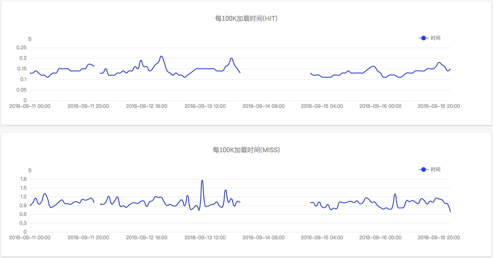
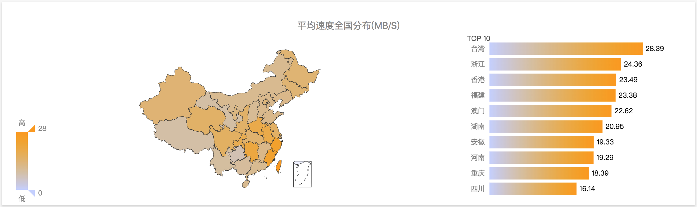

### 功能&特性

通过导入对应域名的CDN日志，可以分析展示基础运维的信息，深入挖掘的运维信息，运营信息。

#### 访问信息

#### 终端信息

### 质量分析

响应时间、响应速度可以进行下钻。点击柱状图展示散点图。点击具体的一个点可以查看原始日志。

### 路径分析
显示 PATH 的访问数据以及流量排序。点击 PATH 可以查看原始日志。

### 查询
查询原始日志，搜索使用的是 ES 语法，例如：A:B AND C:D

### 实时 CDN 刷新分析

更多的展示维度正在酝酿中，敬请期待。