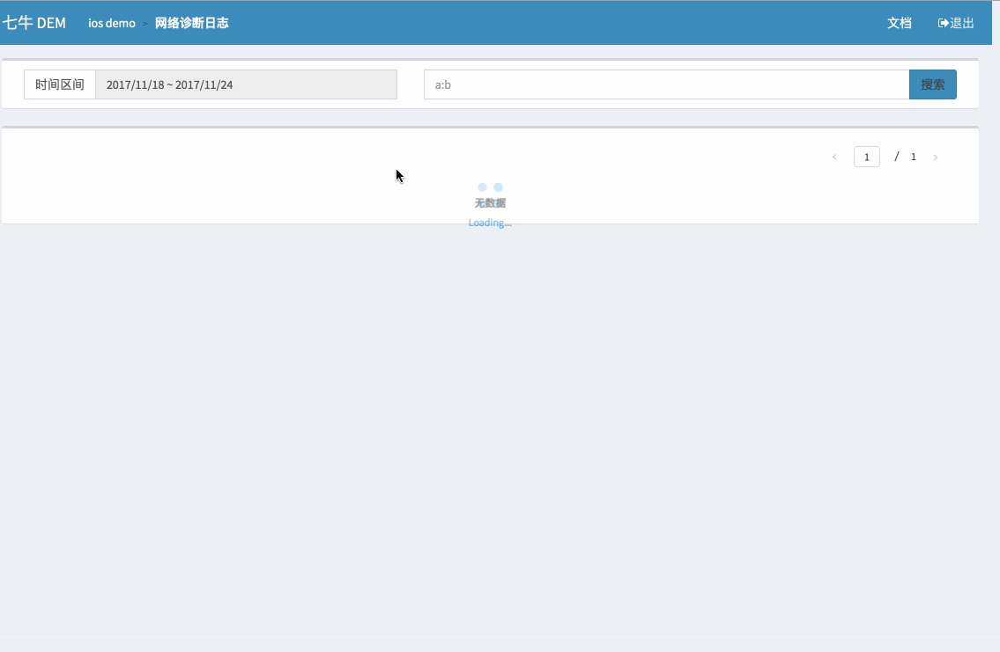

### 功能&特性

* 详细的网络信息及对 APP 当时环境信息进行上报
* 可以搜索指定设备
* 历史信息永久存储
* 通过 workflow 自定义分析

网络诊断功能会使用包括 ping, traceroute 等一系列网络工具对您指定的服务器进行网络诊断并将诊断结果（包括 Ping，Tcp Ping，http request，DNS 等指标）上传至 APM 服务器。

Portal 数据查看方法如下：

