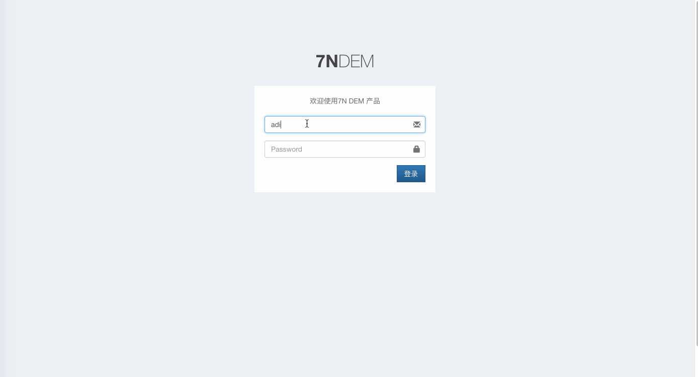

请在浏览器中打开 [APM 主页](https://predem.qiniu.com/login)，然后即可如下图所示，快速创建您的第一个 App。
* 在创建 App 时，您可以选择开启或关闭各个功能组件，如崩溃上报、网络性能上报和App卡顿监控，这些开关默认都是开启的

App 创建成功之后，请到该 App 的 `应用信息` 页面，获取 `上报域名` 和 `App Key`，供相关 SDK 上报数据使用。