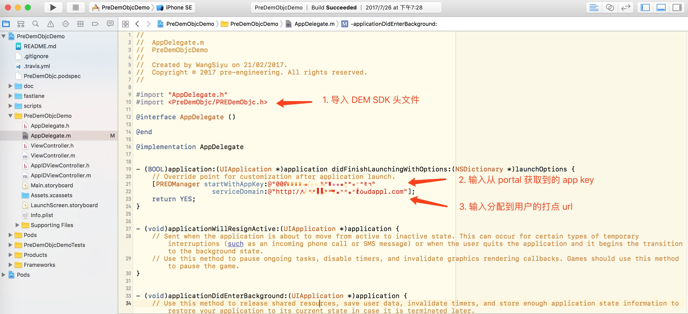

## 简介

pre-dem-cocoa 是由[七牛云](https://www.qiniu.com)发起和维护的针对 Objective-C 的集用户体验监控及报障于一体的开源 SDK，具有无埋点集成，轻量级，高性能等优点

## 功能清单

| 功能 | 版本 |
| - | - |
| HTTP 性能监控 | v1.0.0 |
| 网络诊断 | v1.0.0 |
| 自定义事件上报 | v1.0.0 |
| 事务上报 | v1.0.0 |

## 安装

使用 [CocoaPods](https://cocoapods.org) 进行安装

```ruby
pod "PreDemCocoa"
```

## 快速集成

首先请根据[创建第一个 App](quickstart/init)的步骤获取 App 的 `App Key`

然后，只需如下两行代码，您便可将 pre-dem-objc sdk 集成到您的 App 中：



具体调用逻辑为：

- 初始化

``` objc
    NSError *error;
    [PREDManager startWithAppKey:@"YOUR_APP_KEY"
                   serviceDomain:@"YOUR_REPORT_DOMAIN"
                        complete:^(BOOL succeess, NSError * _Nullable error) {
                            if (error) {
                                NSLog(@"initialize PREDManager error: %@", error);
                            }
                        }];
```

初始化之后，SDK 便会自动采集包括HTTP 请求等监控数据并上报到您指定的服务器

- 网络诊断

``` objc
    [PREDManager  diagnose:@"YOUR_SERVER"
                  complete:^(PREDNetDiagResult * _Nonnull result) {
        NSLog(@"new diagnose completed with result:\n %@", result);
    }];
```

网络诊断功能会使用包括 ping, traceroute 等一系列网络工具对您指定的服务器进行网络诊断并将诊断结果上传服务器。

- 自定义事件

``` objc
    NSDictionary *dict = @{
                           @"PARAMETER_KEY1": @"PARAMETER_VALUE1",
                           @"PARAMETER_KEY2": @"PARAMETER_VALUE2"
                           };
    PREDEvent *event = [PREDEvent eventWithName:@"YOUR_EVENT_NAME" contentDic:dict];
    [PREDManager trackEvent:event];
```
自定义事件上报功能能够将您自定义的事件直接上报至服务器。

- 事务上报

开始一个事务
``` objc
PREDTransaction *transaction = [PREDManager transactionStart:@"test"];
```

将一个事务标识为完成并上传数据到服务器（！注意一个事务只能标识一次完成，之后应该释放该对象，多次标识完成会造成统计出现偏差）
``` objc
[transaction complete];
```

将一个事务标识为被取消并上传数据到服务器（！注意一个事务只能标识一次被取消，之后应该释放该对象，多次标识完成会造成统计出现偏差）
``` objc
[transaction cancelWithReason:@"test reason for cancelled transaction"];
```

将一个事务标识为失败并上传数据到服务器（！注意一个事务只能标识一次被取消，之后应该释放该对象，多次标识完成会造成统计出现偏差）
``` objc
[transaction failWithReason:@"test reason for failed transaction"];
```